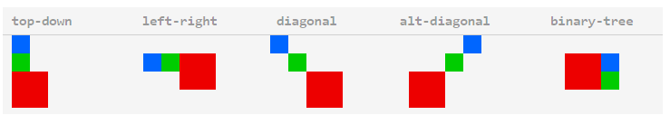

## gulp.spritesmith
> 此插件用于拼接图片为雪碧图 同时生成对应的样式表，并且还支持输出 Sass stylus less甚至JSON等多种格式

## 参数配置 param options

 > spritesmith(params)

 params 类型 object 里面包含众多配置项

 - **imgName** 类型String 作为保存生成雪碧图的文件名
 	- 支持图片的扩展名有.png .jpg .jpeg(限于特殊引擎)
 	- 图片类型可以通过配置项下imgOpts对象的imgOpts.format来覆盖 
 - **cssName** 类型String 作为生成css的文件名
	- 支持css的扩展名有.css(CSS) .sass(SASS), .scss(SCSS),.less(LESS),.styl/.stylus(Stylis),.json(JSON)
	- css类型可以通过cssFormat 覆盖重写
 - **imgPath** 类型String 配置css中对应image的图片路径名
 - **padding** 类型Number 配置雪碧图中两图之间预留的像素值
 	- 默认图片间不使用padding,即为(0)
 - **algorithm** 类型String 配置如何打包图片的算法
 	- 默认我们使用binary-tree(二进制树),尽可能有效率的打包图片
 	- alt-diagonal(反对角线),这种方式取保图片溢出的时候无重叠
 	- diagonal(正对角线)
 	- top-down (上下方式)，默认顺序是 最小在上 最大在下 集中在一列
 	- left-right (左右方式),默认顺序是 最小在左 最大在右 集中在一行
 - **algorithmOpts** 类型Object 算法的配置项
 	- ``{algorithmOpts: {sort: false}}`` 改变拼图顺序 这在做雪碧图动画的时候 非常有用
 - **engine** 类型String  配置图片生成引擎
 	- 默认使用pixelsmith,一个基于node的引擎 支持所有通用图片格式
 	- 其他引擎必须通过npm install去安装
 	- 一个引擎使用案例demo[点击](https://www.npmjs.com/package/gulp.spritesmith/#engine)，demo中使用了另外一个 phantomjssmith 引擎
 	- canvassmith 是一个基于[node-canvas](https://github.com/Automattic/node-canvas)在[Cario](https://www.cairographics.org/)(一个2D图形库)上运行的引擎；必须条件：cario和node-gyp必须安装在电脑上；重要的不同点：canvas有这最优的表现(在超过100个拼图尤为明显),然后只有Unix可用
 	- gmsmith 是一个基于运行于Graphics Magick 或者 Image Magick上的gm引擎库；关键不同点：允许设置图片质量，其他引擎不允许
 - **engineOpts** 类型Object 引擎配置项
 	- 比如 gmsmith phantomjssmith 接受timeout(超时)``{engineOpts: {timeout: 10000}}``
 - **cssFormat** 类型String 可使用的css类型
 	- 默认 这是推断cssName的格式扩展
 - **cssTemplate** 类型 String|Function 渲染css输出所使用的模板
 	- 此操作会覆盖 cssFormat
 	- 如果传入的是字符串，那么必须是一个[handlebars](http://handlebarsjs.com/)模板的路径
 		- [demo](https://www.npmjs.com/package/gulp.spritesmith/#handlebars-template)
 	- 如果是一个function 那必须是一个含有data参数的function，用于生成一个自定义模板js-yaml
 		- [demo](https://www.npmjs.com/package/gulp.spritesmith/#template-function)
 	- 更多模板信息 查看 [地址](https://www.npmjs.com/package/gulp.spritesmith/#templating)
 - **cssHandlebarsHelpers** 
 - **cssVarMap**
 - **cssSpritesheetName**
 - **cssOpts**

 ## Retina parameters 视网膜屏幕参数

 gulp.spritesmith 支持通过使用retinaSrcFilter和retinaImgName来生成视网膜屏的雪碧图。如果至少其中一个参数被提供了，那么我们将接受生成其他高分辨率雪碧图

 我们接受来自同一个gulp.src的普通和高分辨率的雪碧图，所以请使用glob包含二者(例如：*.png应该包含icon-home.png和icon-home@2x.png)

 > 我们强烈鼓励只用@2x后缀作为标准 而不是使用-retina 或者 -2x等写法;这样写会容易会引起一些问题 比如"-"分隔符在常规和retina后缀之间

 ### 参数说明
 - **retinaSrcFilter** 类型string 用于过滤高分辨率图 路径
 - **retinaImgName** 类型String 生成的高分辨率图的名称
 - **retinaImgPath** 高分辨率图的背景图路径
